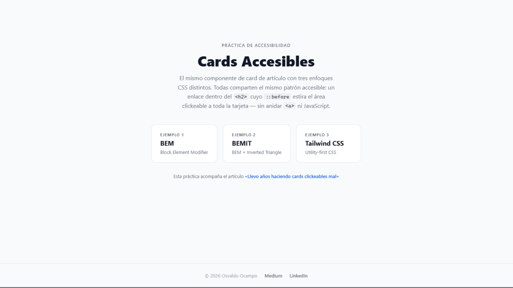

# Cards Accesibles

> El mismo componente de _card_ de artículo, resuelto con **tres enfoques CSS distintos** — BEM, BEMIT y Tailwind CSS — sobre el mismo patrón de accesibilidad: el **stretched link**.

[](#)
[](#)
[](#)
[](#)
[](#)
[](#)
[](#)

---

## 🚀 Demo

[](https://cards-accesibles.netlify.app)

🔗 **[cards-accesibles.netlify.app](https://cards-accesibles.netlify.app)**

📖 Práctica que acompaña el artículo en Medium: [**«Llevo años haciendo cards clickeables mal»**](https://medium.com/@osvaocampo/llevo-a%C3%B1os-haciendo-cards-clickeables-mal-y-t%C3%BA-probablemente-tambi%C3%A9n-7fa1b96478ba)

## 🖼️ Preview



## ✨ Features

- ♿ **Patrón _stretched link_** accesible, sin anidar `<a>` ni JavaScript
- 🧩 **Tres enfoques CSS** del mismo componente: BEM, BEMIT (BEM + ITCSS) y Tailwind v4
- 🎨 **Sistema de tokens CSS** en dos capas (primitivos + semánticos) en BEM, BEMIT e index
- 📱 **Responsive** y con `:focus-visible` propio por cada vista
- 🤸 **Animación de entrada** que respeta `prefers-reduced-motion`
- ⚡ **Vite multi-página** sin configuración (detecta los `.html` por convención)

---

## 📐 El patrón: _stretched link_

Los tres ejemplos comparten la **misma estructura HTML accesible** — no un `<a>` que envuelve toda la card:

- `<article>` como raíz semántica con `position: relative`.
- El enlace del título vive dentro del `<h2>`; su `::before` con `inset: 0` estira el área clickeable a toda la tarjeta.
- **Dos enlaces por card → dos _tab stops_**: la categoría (tag) y el título. El tag lleva `z-index: 2` para seguir siendo clickeable sobre el `::before`.
- Imagen decorativa con `alt=""` (el título ya describe el contenido) y `<time datetime>` para fecha machine-readable.

## 🧩 Los tres enfoques

| Enfoque | Qué demuestra |
| --- | --- |
| **BEM** (`src/bem/card.scss`) | Clases planas sin namespaces. Bloques `.demo` y `.card`, elementos `&__elemento`. Estética brutalista. |
| **BEMIT** (`src/bemit/card.scss`) | BEM + ITCSS con namespaces de capa: `o-` objetos, `c-` componentes, `u-` utilidades, `is-` estados. Estética editorial. |
| **Tailwind** (`src/tailwind/styles.css`) | Utility-first: todo el estilo en clases en el HTML. El foco del `article` se gestiona con `:has()`. Dark mode. |

## 🎨 Tokens de color (custom properties, dos capas)

BEM, BEMIT e index definen sus colores como **CSS custom properties** en `:root`, en dos capas:

- **Primitivos** — inventario crudo de la paleta, nombrados por familia de color + escala numérica: `--blue-600`, `--gray-100`, `--cream-50`.
- **Semánticos** — el rol/uso, apuntan a un primitivo vía `var()`: `--c-accent: var(--blue-600)`, `--c-text`, `--c-bg-card`.

Para tematizar (claro/oscuro, marca alterna) se redefine **solo la capa semántica** en un scope; los primitivos y los componentes no se tocan. Sass queda reservado al anidamiento.

---

## 🏁 Inicio rápido

> Requiere **pnpm v10+**.

```bash
git clone https://github.com/Osvalam86/cards-accesibles.git
cd cards-accesibles
pnpm install
pnpm dev          # http://localhost:5173
```

## 📜 Scripts

| Comando | Descripción |
| --- | --- |
| `pnpm dev` | Levanta Vite en `localhost:5173` |
| `pnpm build` | Build de producción en `dist/` |
| `pnpm preview` | Previsualiza el build de producción |

## 📁 Estructura

```
├── index.html          # landing con navegación entre los 3 ejemplos
├── bem.html            # ejemplo BEM
├── bemit.html          # ejemplo BEMIT
├── tailwind.html       # ejemplo Tailwind CSS
├── public/
│   └── placeholder.svg # imagen placeholder 16:9
└── src/
    ├── shared.css      # animación de entrada compartida
    ├── index/styles.css # estilos de la landing
    ├── bem/card.scss   # estilos BEM
    ├── bemit/card.scss # estilos BEMIT
    └── tailwind/styles.css # @import "tailwindcss"
```

---

## 🌐 Deploy (Netlify)

Proyecto Vite estático:

- **Build command:** `pnpm build`
- **Publish directory:** `dist`

---

## 📄 Licencia

[MIT](LICENSE) © 2026 Osvaldo Ocampo

## ✍️ Autor

**Osvaldo Ocampo**

[](https://github.com/Osvalam86)
[](https://medium.com/@osvaocampo)
[](https://www.linkedin.com/in/osvaldo-ocampo/)
